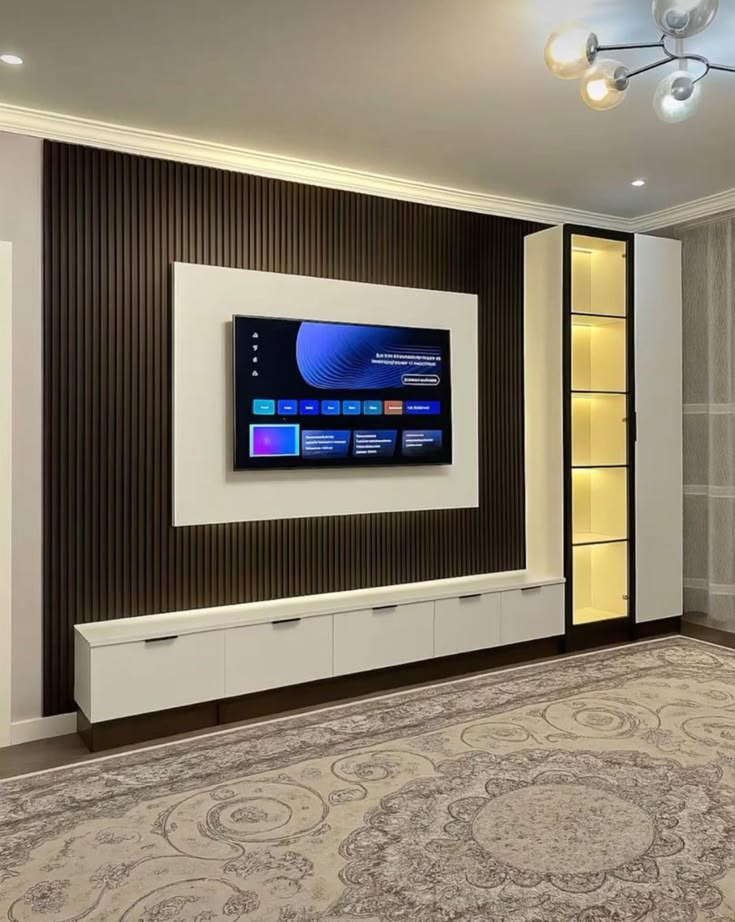
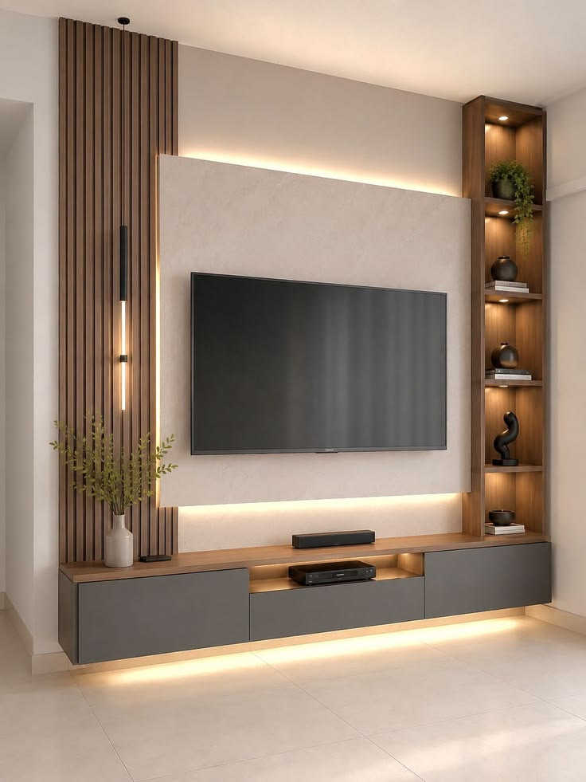
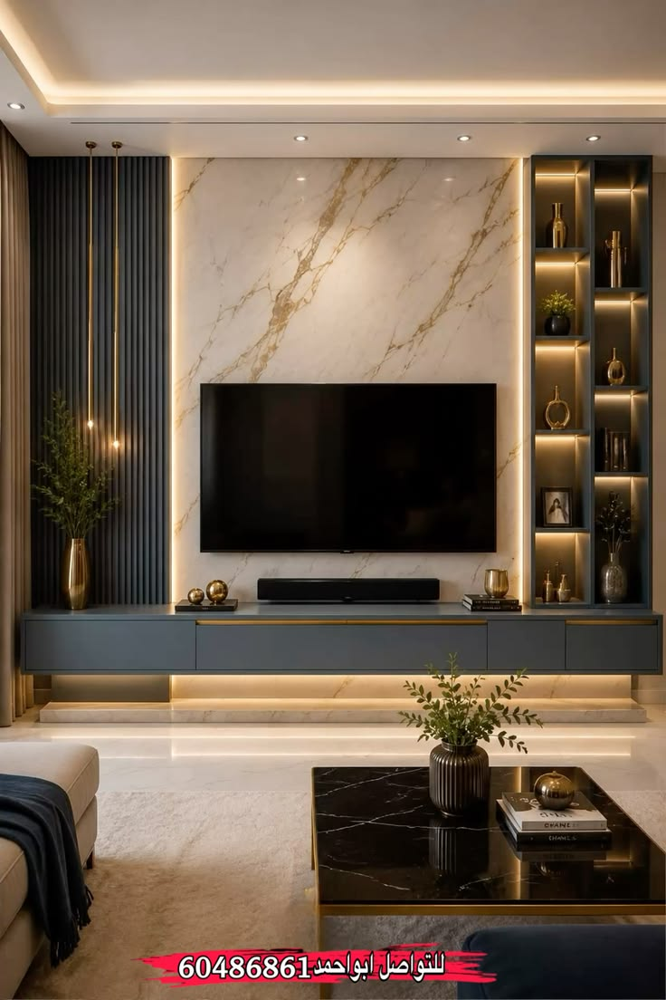
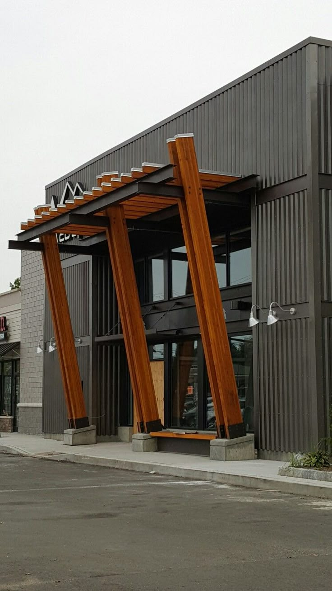
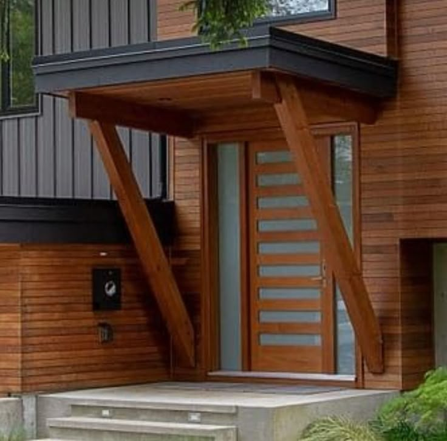

<!DOCTYPE html>
<html lang="fr">
<head>
    <meta charset="UTF-8">
    <meta name="viewport" content="width=device-width, initial-scale=1.0">
    <title>Technobois - Menuiserie & Mobilier sur Mesure</title>
    
</head>
<body>

    <header>
        <h1>Technobois</h1>
        
Menuiserie & Fabrication de Mobilier sur Mesure

    </header>

    

        
        <h2 class="section-title">Nos Réalisations</h2>

        

            

                
                

                    
Cuisine Américaine Sur Mesure

                    
Conception et pose de meubles de cuisine modernes en panneaux HDF/MDF haute densité.

                

            

            

                
                

                    
Meuble TV & Habillage Mural

                    
Design sur mesure pour salon, intégration de rangements et passages de câbles discrets.

                

            

            

                
                

                    
Porte en Bois Massif

                    
Menuiserie extérieure et intérieure robuste et finitions soignées.

                

            

            

                
                

                    
Aménagement & Mobilier

                    
Fabrication de mobilier d'intérieur personnalisé selon vos besoins.

                

            

            

                
                

                    
Menuiserie & Finitions

                    
Assemblage artisanal de haute précision et pose à domicile.

                

            

        

        

            <h3>Un projet sur mesure ?</h3>
            
Contactez-nous pour obtenir un devis gratuit pour vos meubles et aménagements.

            <a href="https://wa.me/2290191399544" class="btn">Demander un devis sur WhatsApp</a>
        

    

</body>
</html>
